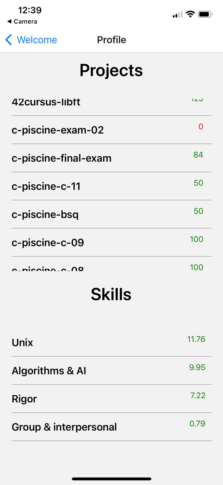

# swifty-companion

This project aims to introduce you to the development of iOS

## Getting Started

These instructions will get you a copy of the project up and running on your local machine for development and testing purposes.

### Installation

1. Clone the repository:

- git clone https://github.com/Szakariia/swifty-companion.git

2. Navigate to the project directory:

- cd swifty-companion

3. Install the required packages:

- npm install

4. run the APK

- npx expo start

5. Expo usage :

- scan the QR that shows using your expo app in your Mobile

## A screenshot of the application

